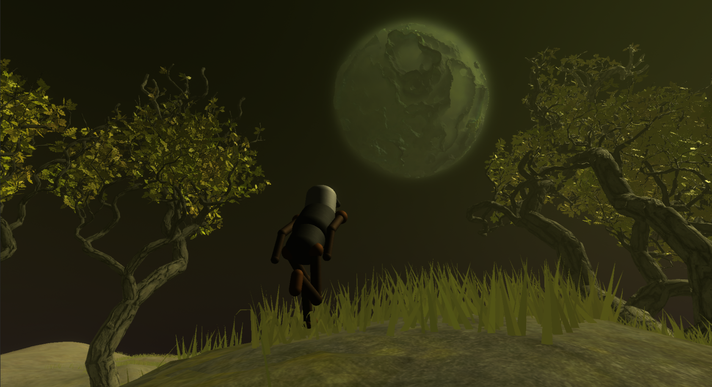
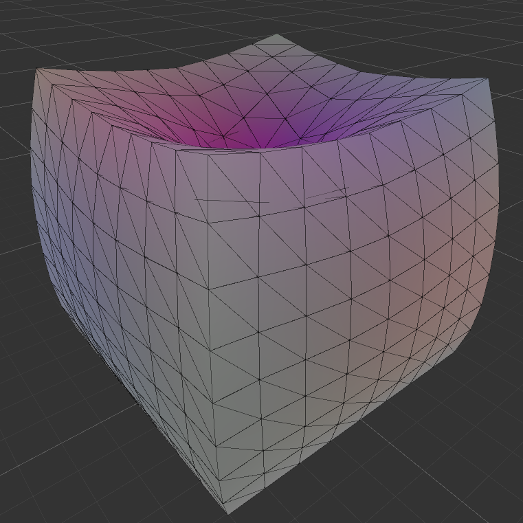
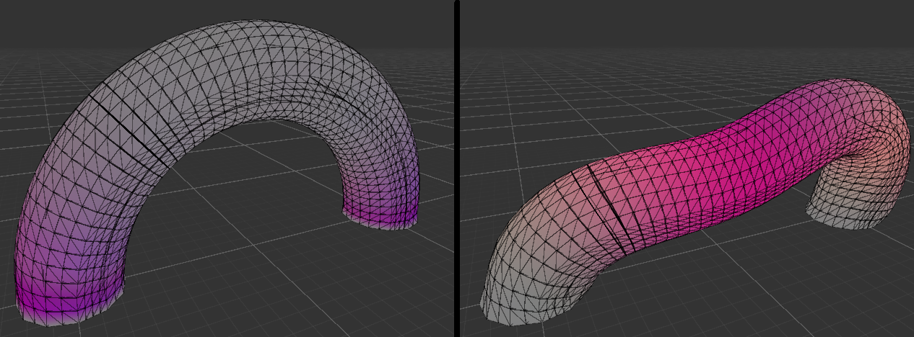

# Project Archive
An archive of favourite projects that I have worked on, at some point in the past. Projects may be missing large data files.

## 2024
- FEA for modelling deformation of [hyperelastic](https://en.wikipedia.org/wiki/Hyperelastic_material) materials - ongoing - A near-real-time parallel solver in HLSL for momentum conservation of an incompressible soft-body under deformation. The model is a hexahedral [volume mesh](https://www.igpm.rwth-aachen.de/brakhage/VolMesh_Pre.pdf) generated by performing Catmull-Clark volume subdivision on a coarse model. The problem is linearised as a weak-form matrix equation which is iteratively solved using Newton-Raphson method, and the model is updated using the Newmark-beta method. Iterative solvers for the matrix equation implemented include BiCGSTAB and GMRES, and preconditioners for these methods currently include RAS, ILU, Gauss-Seidel, and multigrid methods which aid convergence. Future plans to use this solver to animate a human face, and train a neural network to approximate solver for real-time solutions.
- CustomSRP - Spring project - A [custom render pipeline](https://docs.unity3d.com/Manual/srp-custom.html) for Unity I am working on. Currently used to implement deferred lighting, shadow volumes, cel shading and mirrors.

## 2023
- Music Theory - Winter project - A system to produce customisable sound waves with a GUI that makes it easy to play notes and many chords in different modes of the diatonic scale, and other scales. The MIDI version outputs the sound on a MIDI channel.
- Ray tracer - Coursework - Distributed ray tracer that handles reflection, refraction, and texture mapping for primitive shapes.
- Bit Logic - Autumn project - A graph-based interface to create logic circuits from basic logical components. Can save logic circuits as procedures and insert them into more abstract circuits. Adapted from NN Builder (spring project).
- Third Law Alignment - Summer project - A procedural planet generation system detailed with procedurally generated grass, trees, paths, and dynamic character animations and camera system capable of naturally traversing this terrain. An improved version of the systems in Third Law (2022), but with less extra features.
- NN Builder - Spring project - A graph-based interface to create neural networks from basic matrix operations, such as a feed forward layer or convolution, with implementations on CPU and GPU. Can save trained networks as procedures and insert them into other networks.

## 2022
- Third Law - Year project - NEA Project for A level - A procedural galaxy generation system that is composed of solar systems each composed of a sun and planets. The player can explore planets, gather materials, and fly between solar systems in a ship.

## Before 2022
- This used to be a GitHub web page of personal projects.

# Select Screenshots

## Ray tracer

*Ray tracer scene.*

*Animated version.*

## Third Law Alignment

*Showcasing grass and terrain.*

*Showcasing tree generation.*

*Showcasing movement over terrain.*

*Showcasing movement during combat.*

## Finite Element Analysis

*Deformation example, pressing down in the centre of a cube (surface traction).*

*Deformation example, pushing arch down and right (uniform force).*

## Bit logic

 
*4-bit counter.*

## CustomSRP

*Screenshot of game entry for game jam using the custom render pipeline.*

## Third Law

 
*Planet exploration in Third Law.*
